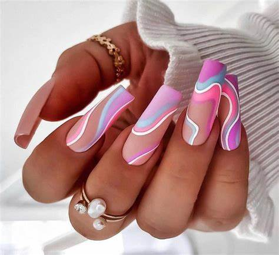
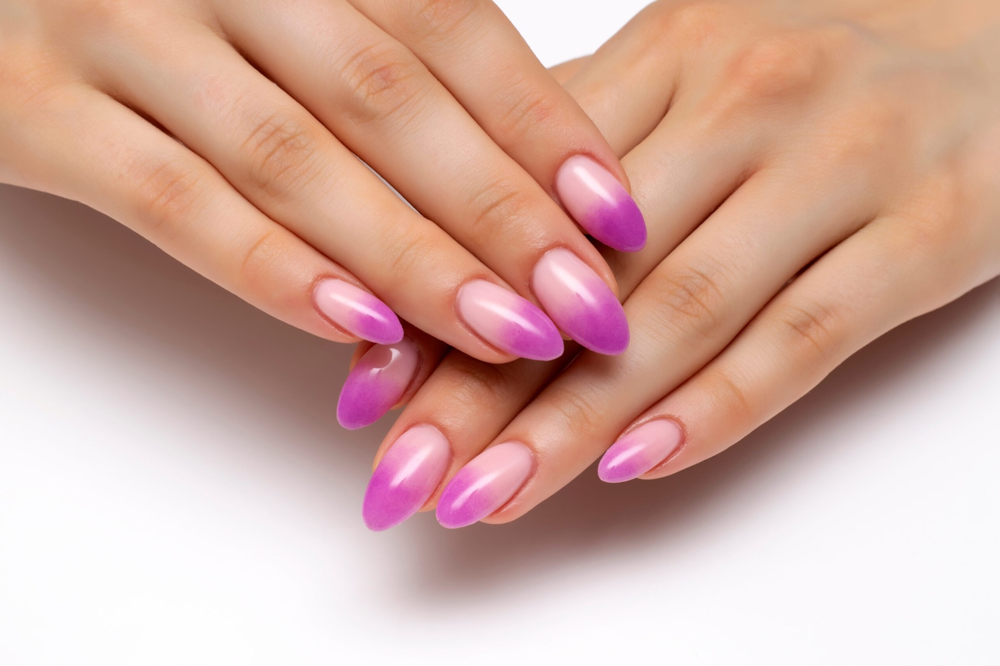

# MauñAl 💅✨

**MauñAl** es una aplicación web diseñada para revolucionar la manera en que las personas encuentran su estilo de uñas ideal, combinando inteligencia artificial con una red de manicuristas profesionales.

## 🌟 Características

- 🎨 Generación de diseños de uñas personalizados mediante IA.
- 📍 Conexión con manicuristas cercanos, con perfil y calificaciones.
- 🗓 Reserva de citas y asesoría virtual.
- 📸 Galería visual con inspiración de estilos reales.
- 📱 Interfaz amigable tanto para clientes como para prestadores de servicios.

## 📁 Cómo usar

1. Abre el archivo `index.html` en cualquier navegador web.
2. Asegúrate de que las imágenes (`maxresdefault.jpg`, `OIP.jpeg`, `set-de-manicura-scaled.jpg`) estén en la misma carpeta.
3. También puedes subir toda la carpeta a [Netlify](https://netlify.com) o GitHub Pages para verla online.

## 📷 Vista previa

### Diseño 1

### Diseño 2

### Diseño 3

## 👤 Autor

Yustin Rua  
Desarrollado como proyecto para asesoría estética con tecnología web moderna.
